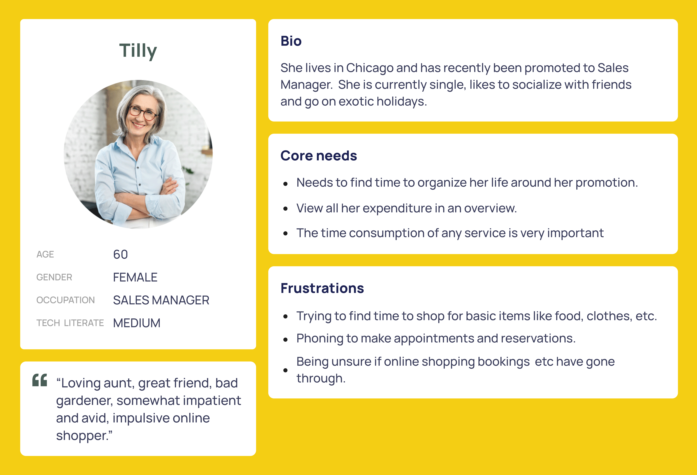
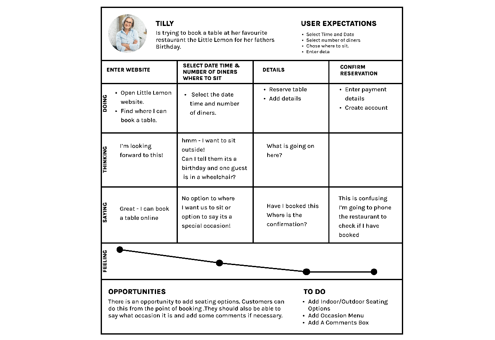

# Recap: Principles of UX and UI
## Overview
In this reading, you will briefly revisit the principles of UX and UI. User experience (UX) refers to how a user interacts with or utilizes a product. So, by giving users meaningful, relevant and satisfying experiences, UX design aims to boost user satisfaction. The user interface or UI is the primary means through which a user communicates with a computer, phone, or another device.

## UX
Typically, the UX design phase of product development happens first, followed by the UI design. There are five primary stages in the UX design process:

### 1. Empathize
Understand users' needs by placing yourself in their shoes and identifying the type of consumer they are. This helps you better understand their requirements and needs.

As a part of this stage, imagine you get permission to interview and observe Adrian's customers at various stages of trying to complete an online booking on the restaurant website. You want to listen to their frustrations.  The key here is to understand your user's needs. From the results of this research, a persona has been created that you can reference throughout the design process of your Little Lemon reserve-a-table web app.

A user journey map has also been created to empathize more with this persona. This will keep your ideas grounded and prevent you from making assumptions.

### 2. Define the problem
Part of user research is identifying the problem. You collate and distill all the information collected from your users and identify the critical issues and needs that they have.   You should prioritize these frustrations or pain points by importance. You now know who your users are, their frustrations and what problems you need to solve. So, you can move on to the next stage.

### 3. Ideation 
Once you know the issues and whom you're solving for, you can ideate. Ideating is generating ideas and solutions for the identified problem through sketching, brainstorming, user flow, mind mapping and even handwriting notes. The key here is to keep an open mind and not commit to one specific idea, which may be iterated throughout the design process. To iterate is to reflect on your work and refine and improve your design.  You will sketch out your ideas into something that will address the Little Lemon customers’ needs. You will then develop them into wireframes.  A wireframe is a two-dimensional representation of the user interface concerned with the placement and hierarchy of content and the functionalities offered, plus the everyday actions that users will take.

### 4. Prototype 
This is a simulation of the final product. You have iterated and refined your ideas into a fresh new solution, but you have yet to prove it will work for everyone and release it.  In this stage, you should first simulate how it will behave with a prototype, take your wireframe and flesh it out. Give it some color, put in some buttons and text and make it interactive.  You can simulate a real scenario for your customers to help them achieve their required goals. Since UX is an iterative process based on user and client feedback, you may also have to iterate at this stage. So, your ideas are constantly being refined into something approaching a final design solution.

### 5. Test and build 
In this final stage, you will test your design. The testing stage is where you present your solution to users and get their feedback. You create a test script with clear instructions for achieving a task or tasks. Your test participants interact with your prototype while trying to accomplish the task. Any frustrations can be communicated and highlighted at this stage and you can go back and address them before the next step.  You’ve listened to users, empathized with them and aimed to solve their needs through iterative design techniques. You've watched them use your product and have tweaked it to make it easier and more intuitive.  Now it's time to build; following these steps can help ensure you create a product that addresses the needs of your users and offers a great user experience.

## UI
Although there are no specific UI design processes, it's crucial, because when it's done correctly, users don't notice it, but when it’s done poorly or not at all, the users will have a bad experience.  A good UI design must be consistent, as consistency is one of the critical factors in usability and learnability. Use UI components and design patterns like those used in the associated design, such as menus, prompts, buttons, input fields, layout, colors and typography. There are several types of consistency in UI, including:

- Visual consistency means that the page's fonts, colors and icon styles should all be consistent. The call-to-action buttons, for instance, must look the same on every page. 

- Functional consistency refers to the behavior of interface controls, such as buttons, menu items and so on, by adhering to the principle of least surprise.

- User-expectation consistency is designing a product consistently by meeting the user's expectations for how it should look or function.

## Conclusion
You now have revisited UX  and UI. You should be able to explain the differences between UX and UI and recognize the importance of putting the customer at the forefront of your decisions as you work on any project. For more detail on UX and UI, please revisit the following lesson items in the Introduction to UX and UI course:

- Introduction to UX and UI
- What is UX?
- UX goals + quality components
- Overview of the UX process
- Empathy tools: Artifacts in the UX process
- What is UI?