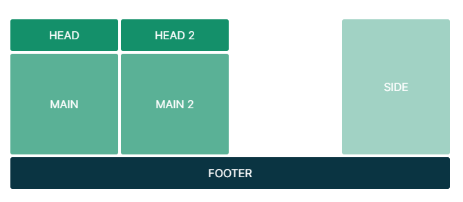
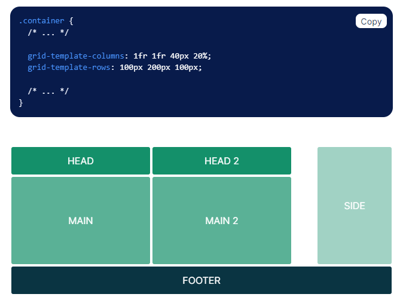

# Recap: CSS grids
## Overview
In this reading, you will recap CSS Grids in preparation for setting up a CSS grid in your Little Lemon web app project.

## What is a CSS Grid?
CSS Grids are two-dimensional web page layouts that are responsible and compatible with various browsers. They are an alternative to Flexbox and tables. In a Grid Layout, columns are vertical tracks and rows are horizontal tracks.

## Using CSS Grid layouts
You can use a CSS grid layout on any collection of elements on your web page. To do so, you need to use the display property and set it to the value of grid. You can think of the display: grid CSS property as sort of a switch that turns the grid display on.

Once you have the CSS grid activated, you can quickly define a simple grid by just using grid-template-columns and grid-template-rows properties.As a reminder, here's an example of this, taken from the [CSS Grids](https://www.coursera.org/learn/html-and-css-in-depth/lecture/VQIRo/css-grids) lesson item from the HTML and CSS in depth course, an earlier course in the Front-End developer program:
```
    .container {
        display: grid;
        grid-template-columns: 100px 100px 100px;
        grid-template-rows: 2fr 1fr; 
    }
```

## The fraction unit
Let’s explore the above code snippet, remember that grids introduce a new unit, fr, which stands for fraction. The fraction unit is a quick way to divide your grid in a straightforward and versatile way. Remember that you can use fraction and pixel values interchangeably in both grid rows and grid columns.

```
.container {
  display: grid;

  grid-template-columns: 1fr 1fr 1fr 1fr;
  grid-template-rows: 100px 200px 100px;

  grid-template-areas:
        "head head2 . side"
        "main main2 . side"
        "footer footer footer footer";
}
```





## The repeat function
Another really useful tool in the grid layout is the repeat CSS function, which allows you to repeat columns or rows so that the code itself is less repetitive. As an example, here's how you'd re-write the above code snippet using the repeat function:

```
.container {
    display: grid;
    grid-template-columns: repeat(3, 100px);
    grid-template-rows: 2fr 1fr;
}
```
The first value given to the repeat function above is the number 3, meaning, there should be three columns in this grid. The second value is the width of each column in the grid - in this case, the width of each column is 100px.

## The minmax function
Another useful function that you can utilize is the minmax function. In the example below, the grid-auto-rows property is used with a call to the minmax function, which sets the value for this grid's rows to 150px each.


```
.container {
    display: grid;
    grid-template-columns: repeat(3, 100px);
    grid-auto-rows: minmax(150px, auto);
}
```
## More on using CSS Grids
It’s important to note that the HTML and CSS in-depth course has additional lesson items that describe how to use CSS grid in more depth. If you need to brush up on additional topics, please take your time to do it. The following links may be helpful.

- [Grids and Flexbox cheat sheet](https://www.coursera.org/learn/html-and-css-in-depth/supplement/A76Uo/grids-and-flexbox-cheat-sheet)

- [Grid showcase](https://www.coursera.org/learn/html-and-css-in-depth/lecture/b91pE/grid-showcase)

- [Grid template area](https://www.coursera.org/learn/html-and-css-in-depth/supplement/IqiL1/grid-template-area)

## Conclusion
In this reading, you revisited the topics of CSS Grid and Grid layouts.  With this recap on CSS grids completed, you are now positioned well to complete the exercise in the next lesson item, Setting up the CSS Grid.