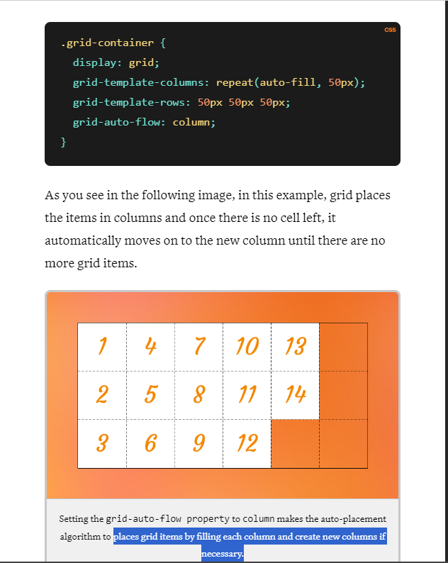

1. Question 1 What is the fr unit in CSS grid?
   - A flexible length unit used only for the images in the grid
   - A flexible length unit that grows or shrinks based on the available space in the grid
   - A flexible color unit to be used in the grid
   - A length unit used only for the texts in the grid
   ```
   answer: A flexible length unit that grows or shrinks based on the available space in the grid
   The fr is a flexible length unit in CSS grid that grows or shrinks based on the available space in the grid. It is used to specify the size of grid tracks (rows or columns) in a grid layout. The fr unit is a proportional unit, meaning that it takes up a fraction of the available space based on the value assigned to it
   ```
2. Question 2 Choose the correct explanation for how the CSS code below works.
 ```
 @media (max-width: 700px) {
  .grid-adjustable-columns {
    display: grid;
    grid-auto-flow: row;
  }
 }

 @media (min-width: 701px) {
  .grid-adjustable-columns {
    width: min(1000px,75rem);
    margin: 0 auto;
    grid-auto-flow: column;
    gap: 1em;
  }
 }
 ```
 - On large resolutions it stacks the grid items in a column and on small resolutions it lines them up in a single row.
 - On small resolutions it stacks the grid items in a column and on large resolutions it lines them up in a single row.
 - This code doesn't work.
 ```
 answer: On small resolutions it stacks the grid items in a column and on large resolutions it lines them up in a single row.
 This code will stack grid items in a column for small resolutions and in a single row for large resolutions.
 ```
 

3. Question 3 Which of the following statements about CSS Grid is true?
 - CSS Grid is a programming language used for creating dynamic and interactive web applications.
 - CSS Grid is a design tool used for creating graphics and visual elements for webpages.
 - CSS Grid is a layout system that allows developers to create grid-based layouts using rows and columns.
 - CSS Grid is a styling system that allows developers to apply styles to specific elements of a webpage.
 ```
 answer: CSS Grid is a layout system that allows developers to create grid-based layouts using rows and columns.
 CSS Grid is a layout system that allows developers to create grid-based layouts using rows and columns. It is a powerful tool for creating flexible and responsive layouts for webpages and applications.
 ```
4. Question 4 In CSS Grid, horizontal tracks are also known as:=
 - Grid items
 - Rows
 - Columns
 ```
 answer: Rows
 Horizontal tracks are referred to as rows. Vertical tracks are referred to as columns.
 ```
 

5. Question 5 True or false: CSS Grid layout automatically adjusts the size of grid tracks.
  - True
  - False
  ```
  answer: False
  explaination: CSS Grid layout does not automatically adjust the size of grid tracks. You can specify the size of grid tracks using the grid-template-columns and grid-template-rows properties.

  While CSS Grid can be a powerful tool for creating responsive layouts, it is not the only way to create responsive web designs. Responsive web design can also be achieved using other techniques such as media queries, flexible layout patterns and responsive images.
  ```